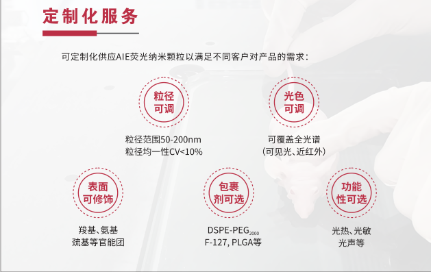
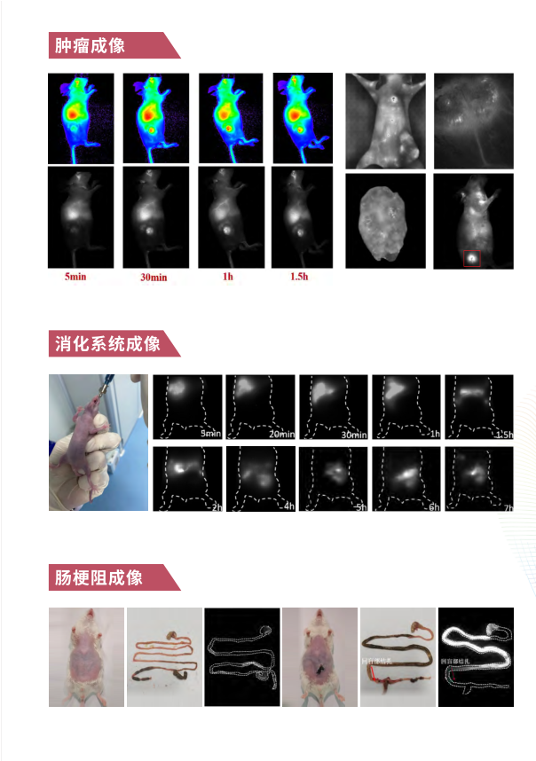
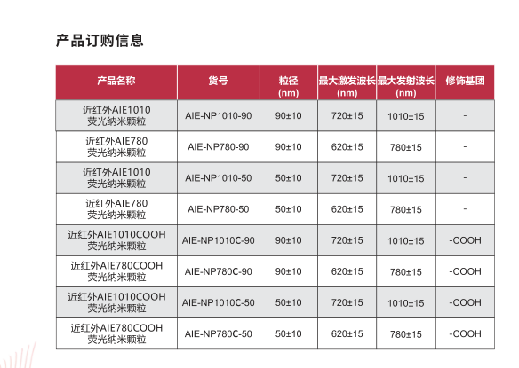

# 近红外纳米粒子：微观世界的明亮探照灯

## 介绍

近红外纳米粒子是一种在近红外光谱范围内发光的微小颗粒，它们的应用正在成像技术中崭露头角。这些纳米粒子不仅可以用作高度灵敏的成像探针，还具备许多在医学、生物学和材料科学等领域的重要应用。

## 近红外光谱的独特之处

### **1. 透明度和穿透深度**

近红外光在生物组织中的透明度较高，而且能够深入穿透组织，不受大部分生物组织的自然吸收和散射的影响。这使得近红外光谱成为理想的成像工具，特别适用于深层组织的研究。

### **2. 较低组织自发发光**

相比于其他波段，近红外光谱中的组织自发发光较低，这有助于提高图像的信噪比，使得成像更为清晰和准确。

## 近红外纳米粒子在成像中的应用

### **1. 生物医学成像**

近红外纳米粒子常用于生物医学成像中，作为荧光探针。它们可以被设计成在近红外波长下发光，使得在深层组织中进行高分辨率成像成为可能。在癌症诊断、血管成像和生物分子检测等方面，近红外纳米粒子发挥着重要的作用。

### **2. 药物传递和治疗监测**

这些纳米粒子还可以被用作药物传递的载体，通过在近红外光下进行成像，实现对药物在体内的定位和释放监测。这为精准药物传递和治疗监测提供了新的途径。

### **3. 环境和材料科学**

在环境监测和材料科学中，近红外纳米粒子的应用也在不断拓展。它们可以作为标记物，用于追踪污染物在水体和土壤中的分布，同时也可以用于纳米材料的表面成像和研究。

## 未来展望

近红外纳米粒子在成像中的应用正在迅速发展，未来有望实现更加精确和高效的成像。随着技术的不断创新，这些纳米粒子有望在医学、生物学和材料科学等多个领域展现更为广泛的应用。

## 结语

近红外纳米粒子如同微观世界的明亮探照灯，为我们揭示了深层组织的奥秘。在医学、科学研究和环境监测等领域，这些纳米粒子的应用正不断推动着技术的进步，为人类健康和科学探索提供了新的可能性。让我们共同期待这一微小但卓有成效的成像工具在未来的发展中发挥更为重要的作用。

