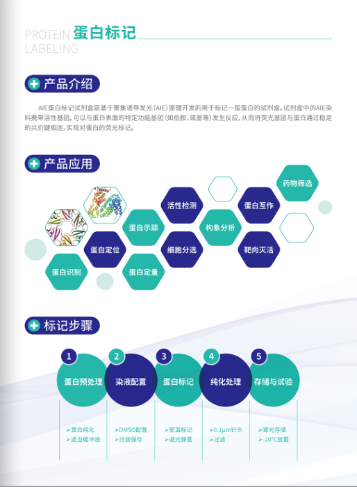

# 生物大分子荧光标记：微观奥秘的绚丽图谱

生物大分子，如普通蛋白、抗原抗体、多肽、DNA和RNA，是构成生命的基石。而荧光标记技术，则为这些微小的生命之精华注入了丰富的色彩，使得它们在显微镜下展现出绚丽多彩的图谱。

## 荧光标记的原理

### **1. 荧光染料的选择**

荧光标记的核心在于选择合适的荧光染料。这些染料能够与生物大分子发生特异性的结合，产生明亮而稳定的荧光信号。

### **2. 特异性结合**

荧光标记要求染料与生物大分子之间有高度特异性的相互作用。这确保了标记只在目标分子上发生，从而提高成像的精确性。

## 生物大分子荧光标记的应用

### **1. 显微镜下的生命舞台**

通过荧光标记，科学家们可以在显微镜下观察生物大分子的分布、形态和相互作用。这为细胞生物学、分子生物学等领域提供了直观的工具，帮助我们更好地理解生命的奥秘。

### **2. 生物医学研究**

在生物医学研究中，荧光标记技术被广泛应用于疾病的诊断和治疗。例如，在癌症研究中，通过标记肿瘤细胞表面的蛋白质，医生可以更早地发现和定位肿瘤。

### **3. 荧光标记在基因工程中的应用**

生物大分子的荧光标记也在基因工程领域发挥着关键作用。在基因表达调控和蛋白质定位研究中，荧光标记帮助科学家们更直观地追踪和研究生物大分子的功能。

## 未来发展

随着荧光标记技术的不断创新，未来有望实现更高灵敏度、更多颜色的标记以及更强大的实时成像能力。这将进一步拓展我们对生命微观世界的认知，为研究和医学应用提供更多可能性。

## 结语

生物大分子荧光标记技术如同一把璀璨的画笔，勾勒出生命之美的绚丽图谱。在科学研究、医学诊断和生命科学的各个领域，这项技术为我们提供了深入探索生命微观奥秘的窗口。让我们共同期待这一技术在未来的发展中，为我们呈现出更为绚烂的生命之色。