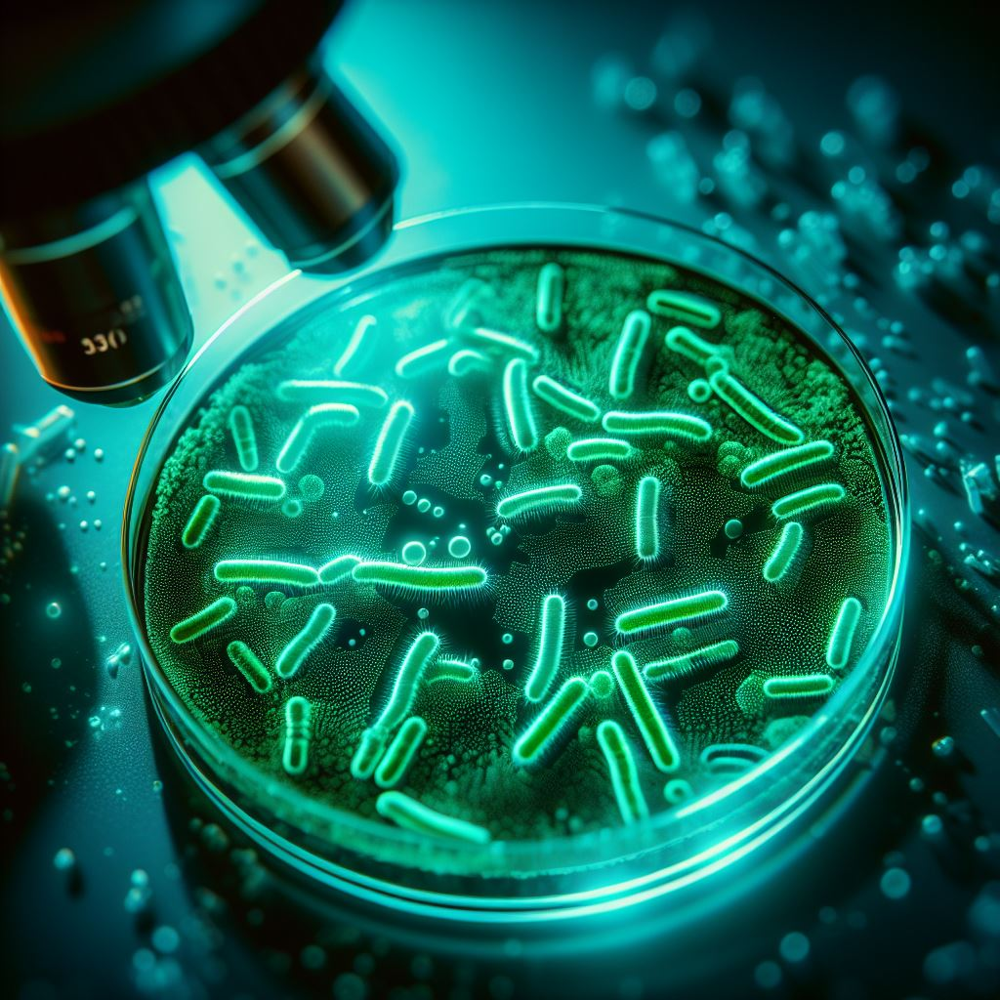

# 微生物荧光成像：探寻微观生命的奥秘

## 微生物的微观世界

微生物，包括细菌、真菌、原生动物等微小生物，构成了生命中微观而丰富的一部分。虽然肉眼无法观察它们的微小身躯，但通过先进的科技，特别是微生物荧光成像技术，我们得以一窥这个微观世界的神奇之处。

## 荧光成像：微生物的“光影艺术”

### **1. 荧光染料的魔力**

荧光成像的核心在于荧光染料。这些染料可以精确地标记微生物的不同部分，如细胞壁、胞浆、核酸等，使它们在显微镜下呈现出美丽的荧光。这就如同微生物穿上了五彩斑斓的外衣，展现出细微而绚丽的“光影艺术”。

### **2. 微生物个体的跟踪**

通过荧光成像技术，科学家们可以追踪单个微生物的运动、生长和分裂过程。这项技术的应用不仅仅停留在实验室的显微镜上，也涉及到自然环境中微生物的观察，帮助我们更好地理解微生物在生态系统中的角色和行为。

## 应用领域：微生物荧光成像的多重用途

### **1. 环境监测与生态学研究**

微生物荧光成像为环境科学提供了独特的视角。在水体、土壤等环境中，科学家们可以通过观察微生物的分布和活动，了解生态系统的动态变化，监测环境污染和生态平衡。

### **2. 医学和生物医学研究**

在医学领域，微生物荧光成像不仅有助于研究病原微生物，还在细菌感染、抗生素研发等方面发挥关键作用。荧光标记的微生物使得科学家们能够更直观地观察它们在宿主体内的行为，为疾病的预防和治疗提供了新的视角。

### **3. 食品安全与工业应用**

微生物荧光成像技术在食品安全和工业生产中也发挥着重要作用。通过观察微生物在食品中的分布，我们可以更及时、准确地检测食品中的微生物污染，确保产品的质量和安全。

## 未来展望：微生物荧光成像的创新与发展

随着科技的不断进步，微生物荧光成像技术也在不断创新。超分辨率成像、多光子显微等新技术的引入，将使我们在观察微生物世界时拥有更为清晰、全面的信息。这不仅将推动科学研究的发展，也将为生态保护、医学诊断等领域带来新的突破。

## 结语

微生物荧光成像技术如同一束光，在微观生命的舞台上投下明亮而多彩的影子。通过这项技术，我们更全面地认识了微生物的生命之美，也为解决环境、医学等方面的重大问题提供了前所未有的工具。让我们一同沉浸在微生物的荧光之海中，探寻这个微观世界的无限奇迹。
