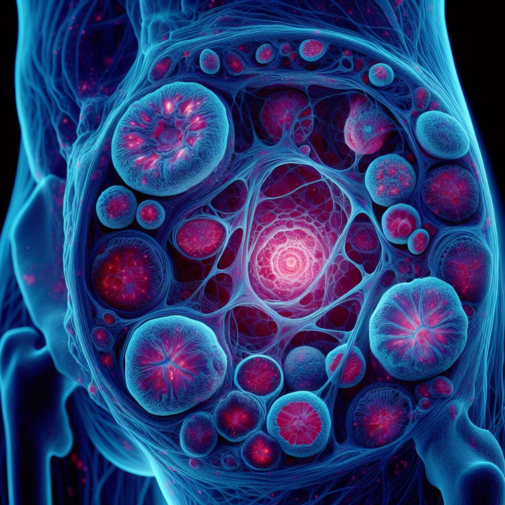
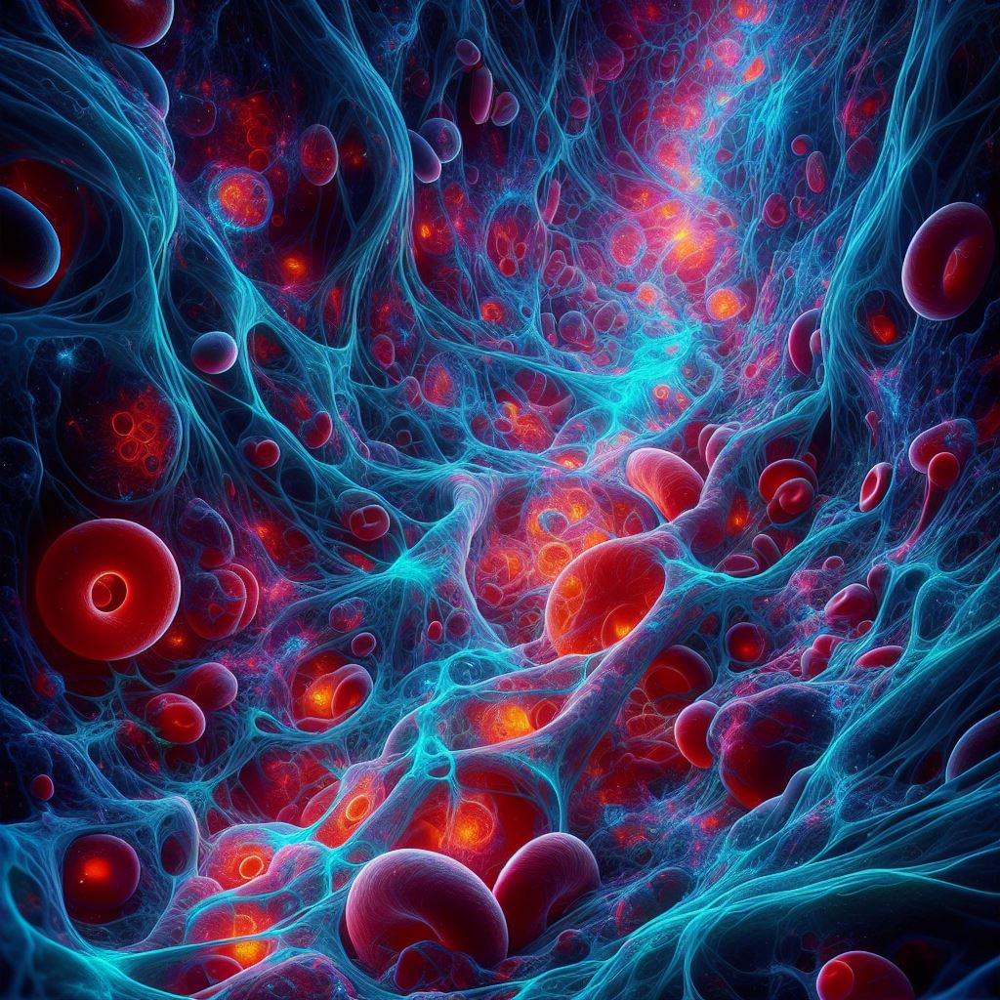
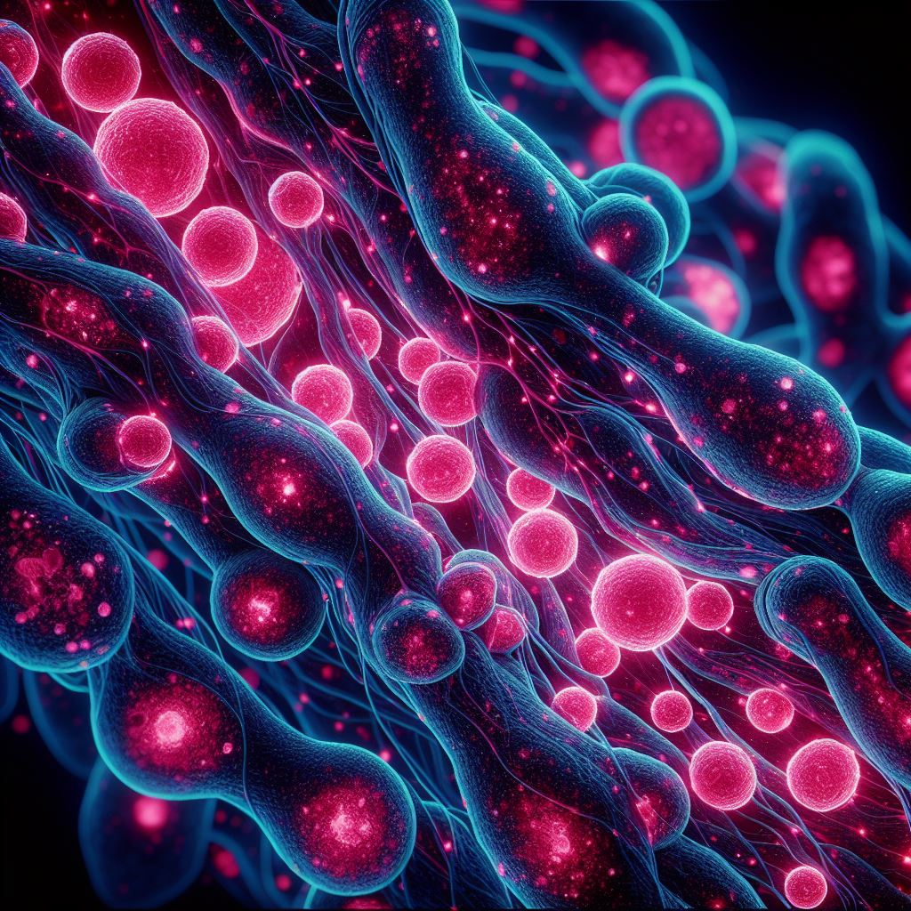

# 体液细胞荧光成像：窥见微小细胞的奇妙世界

## 介绍

在人体内流动的体液，包括关节液、胸腔积液和血液等，蕴含着许多身体健康的关键信息。通过先进的细胞荧光成像技术，我们得以深入这些体液内部，观察细胞的微小变化，为医学诊断和疾病研究提供了强大的工具。

## 荧光成像技术的应用

### **1. 关节液中的奥秘**

关节液是包裹在关节内的液体，对关节的润滑和养护至关重要。通过荧光成像技术，我们可以观察关节液中的细胞，监测炎症的发展和关节疾病的变化，为风湿性关节炎等疾病的早期诊断提供帮助。

### **2. 胸腔积液的探索**

胸腔积液是积聚在胸腔中的液体，其成分与身体的健康状况密切相关。荧光成像技术允许我们在胸腔积液中观察到细胞的形态和数量，帮助医生更全面地了解胸腔积液的性质，对肺部疾病进行更准确的诊断。

### **3. 血液中的微观世界**

血液是身体中最重要的液体之一，携带着氧气、养分和免疫细胞。通过荧光成像，我们可以深入血液，观察红细胞、白细胞等细胞的状态，探寻血液中疾病的病理生理过程，为血液病、感染性疾病等提供更准确的诊断和治疗依据。

## 荧光染料的神奇之处

### **1. 细胞的精准标记**

荧光染料可以精准地标记特定类型的细胞，使其在显微镜下呈现出荧光信号。这就像在体液中点亮了微小的灯火，让我们可以清晰地看到细胞的形态和分布。

### **2. 多通道荧光成像**

利用不同颜色的荧光染料，可以进行多通道荧光成像。这使得我们可以同时观察多种细胞类型，获取更为丰富的信息，有助于全面了解体液内部的微观结构。

## 科学与医学的交汇

体液细胞荧光成像技术的应用不仅仅停留在科学研究上，它还深刻地影响着医学领域。通过观察体液中的微小细胞，医生们能够更早地发现疾病迹象，制定更个体化的治疗方案，提高医疗效果。

## 未来展望

随着科技的飞速发展，体液细胞荧光成像技术将会迎来更多的创新。超高分辨率成像、实时动态监测等新技术的引入，将进一步扩展我们对体液微观世界的认知，为疾病的早期预测和个性化治疗带来新的可能。

## 结语

体液细胞荧光成像技术如同一扇打开的窗户，让我们得以深入体液内部，观察微小细胞的神秘世界。通过这项技术，我们可以更准确地了解身体内部的状态，为健康提供更全面的保障。让我们共同探索这个微观奇迹，为科学与医学的进步贡献一份力量。
