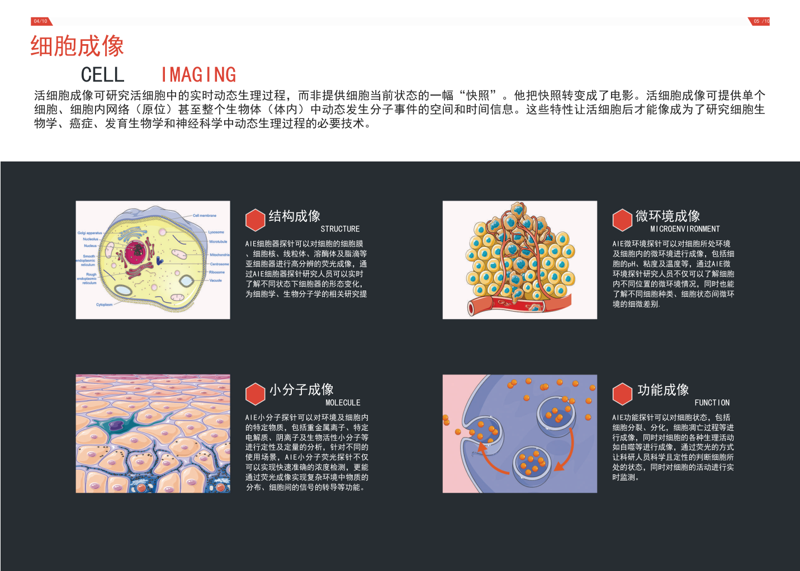
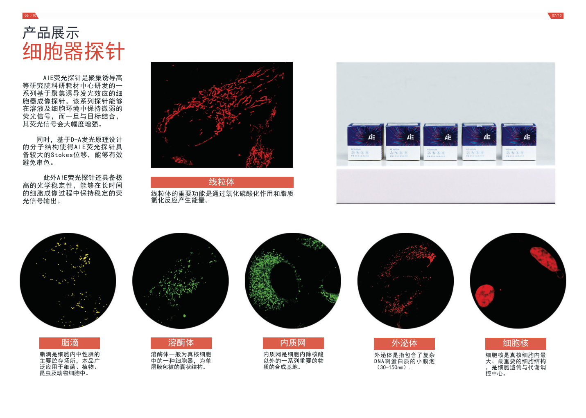

# 探秘微观世界：细胞器荧光成像的魔法之旅

细胞，是生命的基本单位，它们的微观世界蕴含着无限的奥秘。而细胞器荧光成像技术，则是一把解锁这些奥秘的魔法钥匙。本文将带领你走进这个令人惊叹的科学领域，一起探寻细胞器荧光成像的神奇之处。

## 细胞器是什么？

在细胞内，有着各种各样的“工厂”和“建筑物”，它们被称为细胞器。比如，细胞核是遗传信息的仓库，内质网是蛋白质合成的工厂，而线粒体则是能量的生产者。这些微小而复杂的结构，共同构成了一个完整的细胞世界。

## 荧光成像的魔法

为了更深入地了解细胞器的结构和功能，科学家们发明了荧光成像技术。这项技术利用荧光染料将细胞器标记成各种颜色，使其在显微镜下呈现出美丽的荧光。这就好比在黑暗的夜空中，点亮了绚丽的星星，让我们看到了平时无法察觉的微妙景象。

## 荧光染料的魅力

荧光染料是荧光成像的关键。这些神奇的分子可以被精准地附着在不同的细胞器上，如同给细胞器穿上了色彩斑斓的外衣。这样一来，在显微镜下，我们就能清晰地看到细胞器的形状、位置，甚至是它们之间的相互作用。

## 用荧光成像解密生命密码

细胞器荧光成像不仅令我们看到了细胞器的“外表”，更让科学家们能够深入研究它们的运作机制。通过观察荧光标记的细胞器，我们可以了解细胞内生物过程的精细调控，揭开细胞的奥秘面纱。

## 应用之广泛

细胞器荧光成像技术不仅仅停留在实验室的显微镜上。在医学领域，它成为了研究疾病、诊断病变的得力工具；在药物研发中，帮助科学家们监测药物在细胞内的作用。甚至在手术中，通过荧光成像，医生们可以更精准地定位和切除肿瘤组织。

## 未来展望

随着科技的不断进步，细胞器荧光成像技术也在不断创新。超分辨率技术、多光子显微镜等新工具的应用，将使我们更加深入地观察细胞器的微观结构，探索生命的更多奥秘。

## 结语

细胞器荧光成像，就像一扇通往微观生命世界的窗户，让我们能够窥探细胞内的美丽与神秘。通过这项技术，我们不仅更深入地了解生命的运作，也为医学、生物学等领域的发展贡献了重要的力量。让我们共同迎接这场微观世界的奇妙之旅，一起揭开生命的神秘面纱。

[产品链接](https://www.aietech.org.cn/probe_one/list/6/7.html)